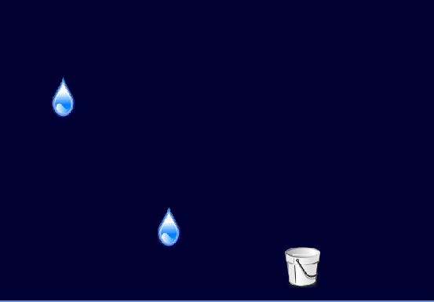
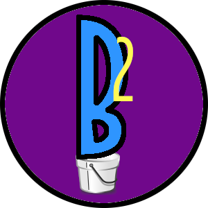

<h1 align="center">Boke2</h1>

<h3 align="center">A very simple game to catch water droplets with a bucket</h3>

## Table Of Contents
[Key Features](#Key-Features) | [Requirements](#Requirements) | [Installation](#Installation)

[Usage](#Usage) | [How To Play](#How-To-Play) | [How To Contribute](#How-To-Contribute)

[Credits](#Credits) | [Support](#Support) | [License](#License)

## Key Features
[Back to top](#Table-Of-Contents)

- You cannot win the game
- You cannot lose the game
- You cannot deny this game makes you relax
- You cannot miss a water droplet before you terminate this game app

## Requirements
[Back to top](#Table-Of-Contents)

- JDK 8: `openjdk version '1.8.0_292'`
- IDE: `IDEA, Eclipse or Netbeans`
- LibGDX: `gdxVersion = '1.10.0'`

## Installation
[Back to top](#Table-Of-Contents)
1. Install all requirements ([Setup Instructions](https://libgdx.com/dev/setup/))
2. Clone the repo ([Cloning Instructions](https://docs.github.com/en/github/creating-cloning-and-archiving-repositories/cloning-a-repository))
3. Import/run the project into your IDE ([See Instructions](https://libgdx.com/dev/import-and-running/))

## Usage
[Back to top](#Table-Of-Contents)

<b>Desktop:</b> `./gradlew desktop:run`

<b>Android:</b> `./gradlew android:installDebug android:run`

<b>iOS:</b> `./gradlew ios:launchIPhoneSimulator`

<b>HTML:</b> `./gradlew html:superDev`

Then go to http://localhost:8080/index.html

## How To Play
[Back to top](#Table-Of-Contents)

Press left arrow key to move the water bucket to the left

Press right arrow key to move the water bucket to the right

Try move the water bucket to catch as many water droplets as you can

Even if you feel naughty to purposely miss some water droplets, that's okay

Boss key (or if you are really done with it) is to mouse left click on close window button

Bonus tips: You can even mouse left click to move the water bucket.  If you are really really in a silly mood, try to resize the window. 

## How To Contribute
[Back to top](#Table-Of-Contents)

1. Clone repo and create a new branch
2. Make changes and test
3. Submit Pull Request with comprehensive description of changes

## Credits
[Back to top](#Table-Of-Contents)
- LibGDX ([Open source package](https://libgdx.com/))
- LibGDX ([Simple game tutorial](https://libgdx.com/dev/simple-game/))

## Support
[Back to top](#Table-Of-Contents)

<b>THANK YOU!!!</b>

## License
[Back to top](#Table-Of-Contents)

[MIT](https://opensource.org/licenses/MIT)